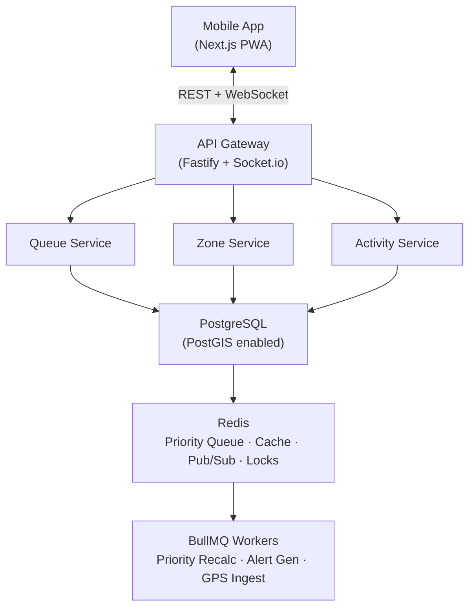
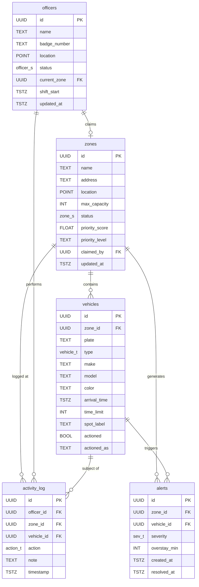
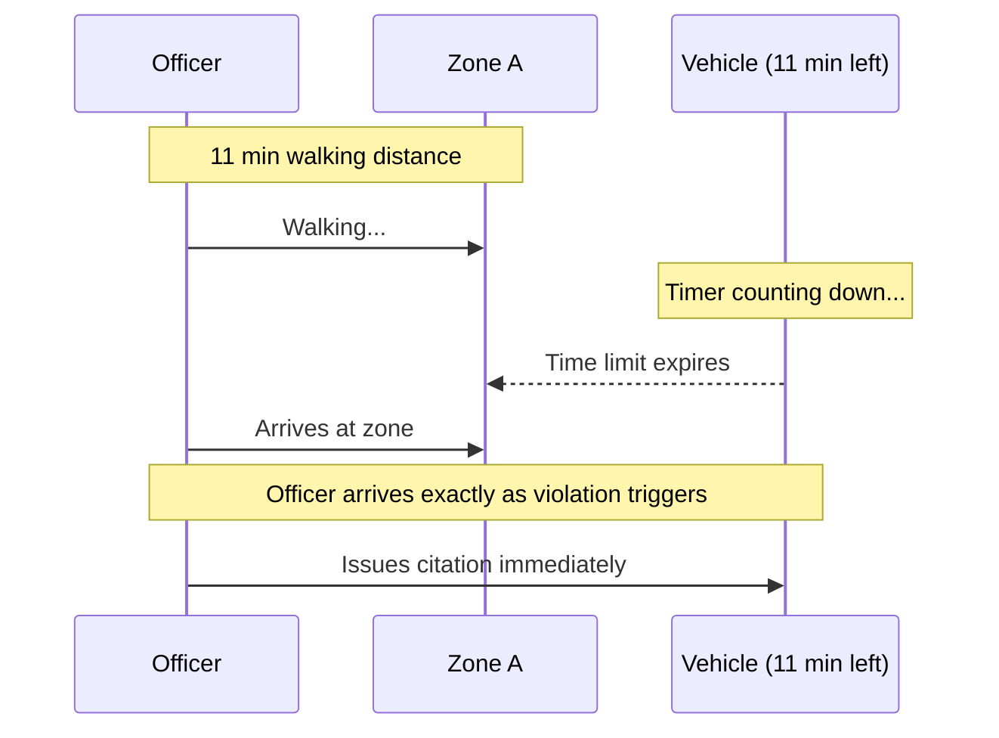
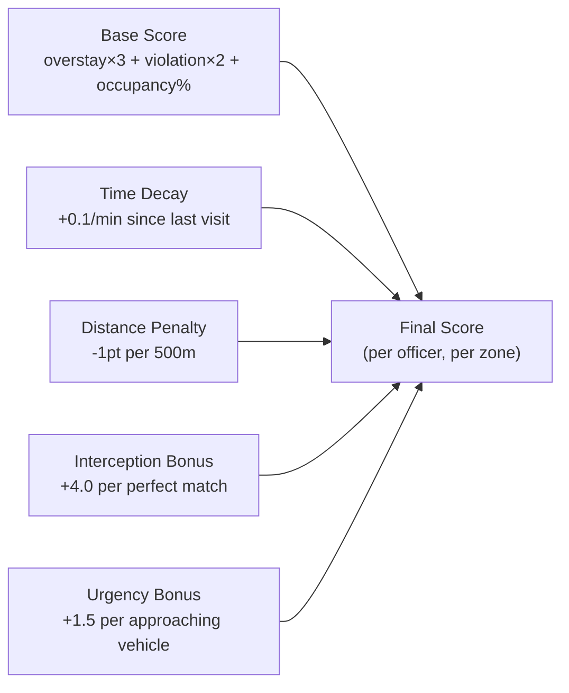
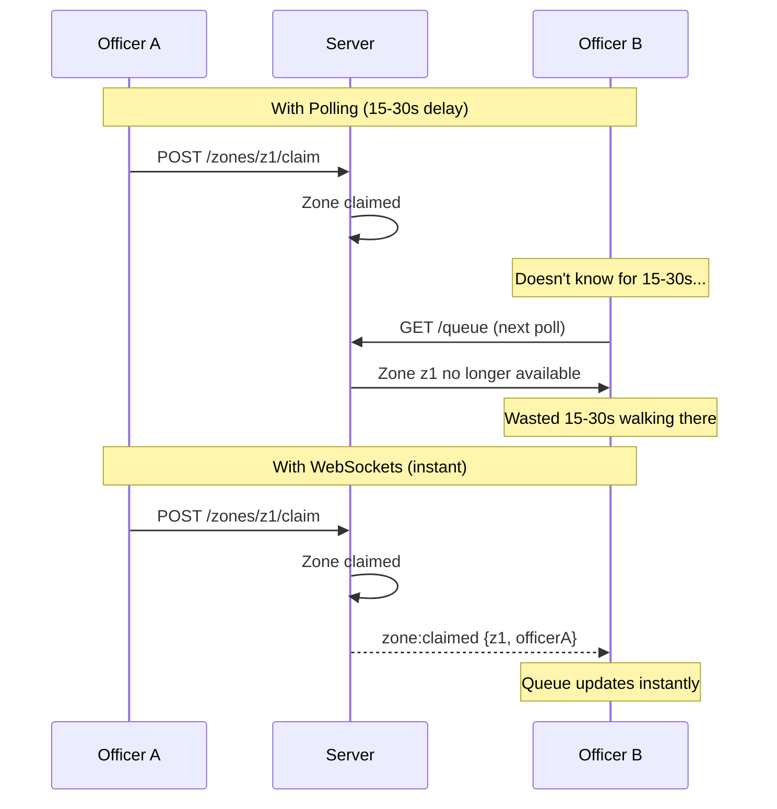
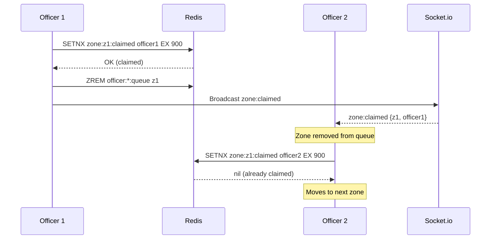
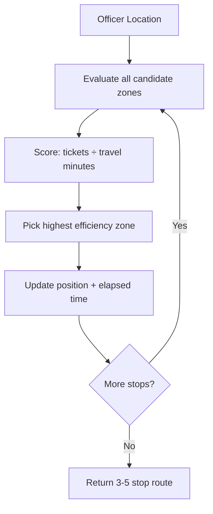
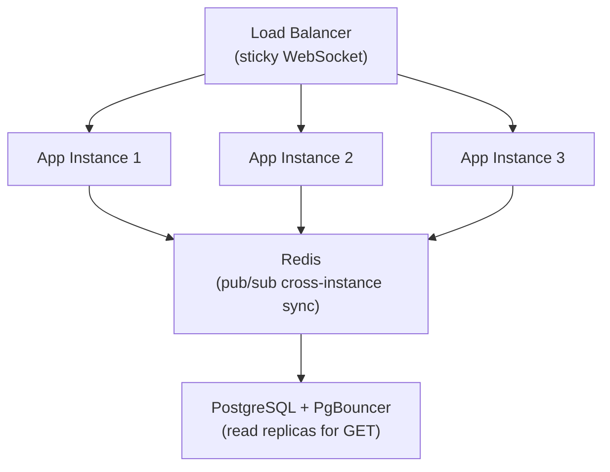

# Backend Architecture — Production Design

> How we'd build the real backend behind Automotus Go's parking enforcement companion app.
> The current prototype uses in-memory Next.js API routes. This document describes the production system.
>
> **Note:** This is a rough sketch — I didn't review it closely. Treat it as directional thinking, not a polished spec.

---

## System Overview



---

## Tech Stack

| Layer | Technology | Why |
|-------|-----------|-----|
| Runtime | Node.js 22 + TypeScript (strict) | Same language as frontend, strict mode catches bugs at compile time |
| Framework | Fastify | 2-3x faster than Express, schema-based validation, first-class TypeScript |
| Database | PostgreSQL 16 + PostGIS | ACID transactions, geospatial queries (`ST_Distance`, `ST_DWithin`), battle-tested |
| ORM | Drizzle | Type-safe queries with zero runtime overhead, SQL-like API, great migration story |
| Cache / Queue | Redis 7 | Sorted sets for priority queue, pub/sub for real-time broadcast, distributed locks for zone claiming |
| Background Jobs | BullMQ | Priority recalculation cron, alert generation, GPS batch processing |
| Real-time | Socket.io | WebSocket abstraction with auto-reconnect, rooms, and fallback to long-polling |
| Validation | Zod | Runtime schema validation, shared between API and client |
| Auth | JWT + RBAC | Stateless auth, role-based access (officer, supervisor, admin) |
| Infra | Docker → Fly.io / Railway | Container-based deploy, edge networking, managed Postgres + Redis add-ons |

---

## Data Model



### Enums

| Enum | Values |
|------|--------|
| `zone_s` | `idle`, `en_route`, `on_scene`, `cleared` |
| `vehicle_t` | `personal`, `rideshare`, `delivery`, `commercial` |
| `action_t` | `cite`, `warn`, `skip`, `depart` |
| `officer_s` | `available`, `en_route`, `on_scene`, `off_duty` |
| `sev_t` | `low`, `medium`, `high` |

### Key Indexes

```sql
CREATE INDEX idx_zones_priority ON zones (priority_score DESC);
CREATE INDEX idx_zones_location ON zones USING GIST (location);
CREATE INDEX idx_vehicles_zone ON vehicles (zone_id) WHERE actioned = false;
CREATE INDEX idx_activity_officer ON activity_log (officer_id, timestamp DESC);
CREATE INDEX idx_alerts_unresolved ON alerts (zone_id) WHERE resolved_at IS NULL;
```

---

## Queue Algorithm

Parking enforcement is a collection problem. Every minute an officer spends walking to the wrong zone is a missed ticket — the driver returns to their car before the officer arrives, and the revenue disappears. The queue algorithm exists to maximize tickets collected per shift by solving one question: **where will the violations be by the time I walk there?**

### Base Formula (current prototype)

```
priority_score = (overstay_count × 3) + (violation_count × 2) + (occupancy_pct / 100)
```

| Factor | Weight | Rationale |
|--------|--------|-----------|
| `overstay_count` | ×3 | Vehicles already past their limit — highest urgency |
| `violation_count` | ×2 | Active violations needing enforcement action |
| `occupancy_pct` | ÷100 | Tiebreaker — fuller zones are more likely to produce new violations soon |

This produces a score where:
- `≥ 4.0` → **HIGH** priority (red marker)
- `≥ 1.0` → **MEDIUM** priority (amber marker)
- `< 1.0` → **CLEAR** (green marker)

### Production Evolution

The base formula works for a single officer. For multi-officer production, we layer on three additional factors:

#### 1. Time Decay

Zones that haven't been visited recently should rise in priority. A zone cleared 2 hours ago might have new violations.

```typescript
const DECAY_RATE = 0.1; // points per minute
const minutesSinceVisit = (now - zone.lastVisitedAt) / 60_000;
const decayBonus = Math.min(minutesSinceVisit * DECAY_RATE, 5.0); // cap at 5
```

#### 2. Distance Weighting

An officer 200m away from a medium-priority zone should go there before a high-priority zone 2km away. We use PostGIS `ST_Distance` to compute walking distance and apply an inverse penalty.

```typescript
const distanceMeters = await db.execute(sql`
  SELECT ST_Distance(
    ${officerLocation}::geography,
    ${zoneLocation}::geography
  )
`);

const distancePenalty = distanceMeters / 500; // 1 point penalty per 500m
```

#### 3. Predictive Interception

This is the key insight: **match officer travel time to vehicle time remaining.** A vehicle whose meter expires in 11 minutes is just as valid a target as an existing violation — the officer just needs to be 11 minutes away. That zone jumps to the top even though time isn't technically up yet. Once the officer arrives and the meter has expired, they collect the ticket. The goal is to maximize the number of collectible violations per shift, not just chase the ones that already exist.



```typescript
const WALKING_SPEED_M_PER_MIN = 80;
const INTERCEPTION_WINDOW_MIN = 3;
const INTERCEPTION_BONUS = 4.0;

function computeInterceptionScore(
  officer: Officer,
  zone: Zone,
  vehicles: Vehicle[]
): number {
  const distanceMeters = haversine(officer.location, zone.location);
  const travelMinutes = distanceMeters / WALKING_SPEED_M_PER_MIN;

  let interceptionScore = 0;

  for (const vehicle of vehicles) {
    if (vehicle.actioned) continue;

    const minutesRemaining = vehicle.time_limit_minutes - vehicle.overstay_minutes;
    if (minutesRemaining <= 0 || minutesRemaining > travelMinutes + 10) continue;

    const timeDelta = Math.abs(minutesRemaining - travelMinutes);

    if (timeDelta <= INTERCEPTION_WINDOW_MIN) {
      const matchQuality = 1 - (timeDelta / INTERCEPTION_WINDOW_MIN);
      interceptionScore += INTERCEPTION_BONUS * matchQuality;
    }
  }

  return interceptionScore;
}
```

**Example:** Officer is 11 min walk from Zone A. Zone A has 3 vehicles:
- Honda Civic: 11 min remaining → `|11 - 11| = 0` → **perfect match** → +4.0
- Ford F-150: 9 min remaining → `|9 - 11| = 2` → within window → +1.3
- Toyota Camry: 35 min remaining → too far out → +0
- **Interception bonus: +5.3** — this zone jumps to the top of the officer's queue

#### 4. Time-Criticality (Approaching Vehicles)

Zones with vehicles close to expiry get a general urgency bonus regardless of officer distance.

```typescript
const approachingCount = vehicles.filter(v => {
  const minutesRemaining = v.time_limit_minutes - v.overstay_minutes;
  return minutesRemaining > 0 && minutesRemaining <= 5;
}).length;

const urgencyBonus = approachingCount * 1.5;
```

#### Combined Production Formula



```typescript
function computeOfficerPriority(
  zone: Zone,
  officer: Officer,
  vehicles: Vehicle[]
): number {
  const overstayCount = vehicles.filter(v => v.overstay_status === 'violation').length;
  const violationCount = vehicles.filter(v => v.overstay_minutes > 0).length;
  const occupancyPct = (vehicles.length / zone.max_capacity) * 100;

  const baseScore =
    (overstayCount * 3) +
    (violationCount * 2) +
    (occupancyPct / 100);

  const minutesSinceVisit = (Date.now() - zone.lastVisitedAt) / 60_000;
  const decayBonus = Math.min(minutesSinceVisit * 0.1, 5.0);
  const distancePenalty = officer.distanceTo(zone) / 500;
  const interceptionBonus = computeInterceptionScore(officer, zone, vehicles);

  const approachingCount = vehicles.filter(v => {
    const remaining = v.time_limit_minutes - v.overstay_minutes;
    return remaining > 0 && remaining <= 5;
  }).length;
  const urgencyBonus = approachingCount * 1.5;

  return baseScore + decayBonus + interceptionBonus + urgencyBonus - distancePenalty;
}
```

**Each officer gets a personalized queue** — same zones, different scores based on their location and which vehicles they can intercept in time.

#### Why Interception Changes Everything

It's a collection problem. The goal is **maximum tickets per shift**, not just reacting to existing violations.

| Without interception | With interception |
|---------------------|-------------------|
| Officer walks to highest-violation zone | Officer walks to zone where violations are about to happen |
| Arrives, waits for vehicles to expire — or worse, driver already left | Arrives exactly as vehicles expire, collects immediately |
| Dead time between arrival and first ticket | First ticket within 1-3 minutes of arrival |
| Missed revenue: drivers return before officers arrive | Approaching vehicles treated as valid targets — collected before they disappear |
| Same queue for all officers | Each officer's queue optimized for their position |

### Redis as the Priority Queue

```
ZADD officer:{officerId}:queue {score} {zoneId}    -- insert/update
ZREVRANGE officer:{officerId}:queue 0 9             -- top 10 zones
ZREM officer:{officerId}:queue {zoneId}             -- remove claimed zone
```

### Recalculation Triggers

| Event | Trigger | Method |
|-------|---------|--------|
| Vehicle arrives/departs | Sensor webhook | Instant — recalc that zone, update all officer queues |
| Officer enforces a vehicle | POST `/api/.../cite` | Instant — zone score drops, replan routes for nearby officers |
| Officer claims a zone | POST `/api/zones/:id/claim` | Instant — remove from other officers' queues and routes |
| Timer tick (every 60s) | BullMQ repeatable job | Batch — recompute all interception scores |
| Officer location update | GPS POST (every 10s) | Batch — recalc travel times |
| Route completion | Officer departs a zone | Instant — replan remaining route from new position |

---

## API Design

All routes are RESTful and match the current mock API shape for frontend compatibility.

```mermaid
graph LR
    subgraph Read
        GQ["GET /api/queue"]
        GZ["GET /api/zones/:id"]
        GA["GET /api/activity"]
    end

    subgraph "Zone Actions"
        PA["POST /api/zones/:id/arrive"]
        PD["POST /api/zones/:id/depart"]
        PC["POST /api/zones/:id/claim"]
    end

    subgraph "Vehicle Enforcement"
        VC["POST .../vehicles/:vid/cite"]
        VW["POST .../vehicles/:vid/warn"]
        VS["POST .../vehicles/:vid/skip"]
    end

    subgraph "Officer"
        OL["POST /api/officers/location"]
        ON["GET /api/officers/nearby"]
    end

    Client["Mobile Client"] --> Read
    Client --> Zone Actions
    Client --> Vehicle Enforcement
    Client --> Officer
```

### Middleware Stack

```typescript
app.register(cors);
app.register(rateLimit, { max: 100, timeWindow: '1 minute' });
app.register(jwt);                          // verify token
app.addHook('onRequest', requireAuth);      // extract officer from JWT
app.addHook('onRequest', validateSchema);   // Zod request validation
```

### Request Validation (Zod)

```typescript
const ClaimZoneParams = z.object({
  id: z.string().uuid(),
});

const EnforceVehicleParams = z.object({
  id: z.string().uuid(),
  vid: z.string().uuid(),
  action: z.enum(['cite', 'warn', 'skip']),
});

const LocationBody = z.object({
  lat: z.number().min(-90).max(90),
  lng: z.number().min(-180).max(180),
});
```

### Response Shape

All mutation endpoints return the affected resources so the client can update its cache without a follow-up GET:

```typescript
// POST /api/zones/:id/vehicles/:vid/cite
return reply.status(201).send({
  zone: updatedZone,       // recalculated priority
  vehicle: citedVehicle,   // actioned = true
  activity: newEntry,      // logged action
});
```

---

## Real-time: Polling vs WebSockets

### Why WebSockets for Production



**The zone-claiming problem alone makes WebSockets mandatory.** Two officers walking to the same zone wastes 10-20 minutes of enforcement time.

### Socket.io Channels

```typescript
io.to(`officer:${officerId}`).emit('queue:updated', sortedQueue);
io.emit('zone:claimed', { zoneId, officerId });
io.emit('zone:status', { zoneId, status: 'on_scene' });
io.emit('officer:location', { officerId, lat, lng });
```

### Resource Cost

| Officers | Memory (connections) | Bandwidth (updates/min) |
|----------|---------------------|------------------------|
| 10 | ~50 KB | ~200 messages |
| 50 | ~250 KB | ~1,000 messages |
| 200 | ~1 MB | ~4,000 messages |

Negligible. A single 512MB server handles 200 officers comfortably.

---

## Multi-Officer Coordination

### Zone Claiming with Distributed Locks



```typescript
async function claimZone(officerId: string, zoneId: string): Promise<boolean> {
  const claimed = await redis.set(
    `zone:${zoneId}:claimed`,
    officerId,
    'NX',
    'EX',
    900 // 15 min TTL
  );

  if (!claimed) return false;

  const officerIds = await redis.smembers('active_officers');
  await Promise.all(
    officerIds
      .filter(id => id !== officerId)
      .map(id => redis.zrem(`officer:${id}:queue`, zoneId))
  );

  io.emit('zone:claimed', { zoneId, officerId });
  return true;
}
```

### Route Optimization (Interception-Aware)

The pathing algorithm doesn't just minimize distance — it maximizes **tickets collected per shift**. Each stop is chosen because vehicles will be in violation by the time the officer walks there. Approaching vehicles are treated as valid targets: time isn't up yet, but it will be when the officer arrives. This turns every minute of walking into a collectible ticket instead of dead time.



**Example output for an officer near Rittenhouse Square:**

```
Route planned (5 stops, ~47 min total):

1. Sansom & 17th (W)    — 3 min walk → 2 tickets on arrival
2. Chestnut & 18th (E)  — 4 min walk → 3 tickets (2 on arrival + 1 expires during visit)
3. Chestnut & 17th      — 2 min walk → 1 ticket on arrival
4. Broad & Sansom       — 6 min walk → 2 tickets (expired by the time we walk there)
5. Rittenhouse NE       — 5 min walk → 2 tickets on arrival

Total: 10 tickets in 47 minutes = 12.8 tickets/hour
```

Without interception-aware routing, the same officer following a pure distance-based path might collect 6-7 tickets in the same time — the rest are missed because drivers return to their cars before the officer arrives.

---

## Scaling Considerations

### Horizontal Scaling



- **Socket.io + Redis adapter**: WebSocket events broadcast across all instances automatically
- **Sticky sessions**: Required for WebSocket upgrade handshake
- **PgBouncer**: Connection pooling — each app instance uses 5-10 connections instead of one per request
- **Read replicas**: `GET /api/queue` and `GET /api/activity` hit replicas; mutations hit primary

### Estimated Capacity per Instance

| Resource | Single Instance | With 3 Instances |
|----------|----------------|-----------------|
| Officers (WebSocket) | 200 | 600 |
| Queue recalcs/min | 500 | 1,500 |
| GPS updates/min | 1,200 | 3,600 |
| DB connections | 10 (pooled) | 30 (pooled) |

A single city deployment (50-100 officers) runs comfortably on **one instance** with Redis and Postgres.

---

## From Prototype to Production

| Prototype (current) | Production |
|---------------------|-----------|
| In-memory arrays | PostgreSQL + PostGIS |
| `computePriorityScore()` in `lib/priority.ts` | `computeOfficerPriority()` with decay, distance, urgency |
| Single sorted array | Redis sorted set per officer |
| React Query polling | Socket.io + React Query cache invalidation |
| No auth | JWT + RBAC (officer, supervisor, admin) |
| No multi-officer | Zone claiming, location sharing, route optimization |
| `npm run dev` | Docker → Fly.io with managed Postgres + Redis |

The frontend stays almost identical. The API contract doesn't change — only the backing implementation and a few new endpoints (`/claim`, `/officers/location`, `/officers/nearby`).
