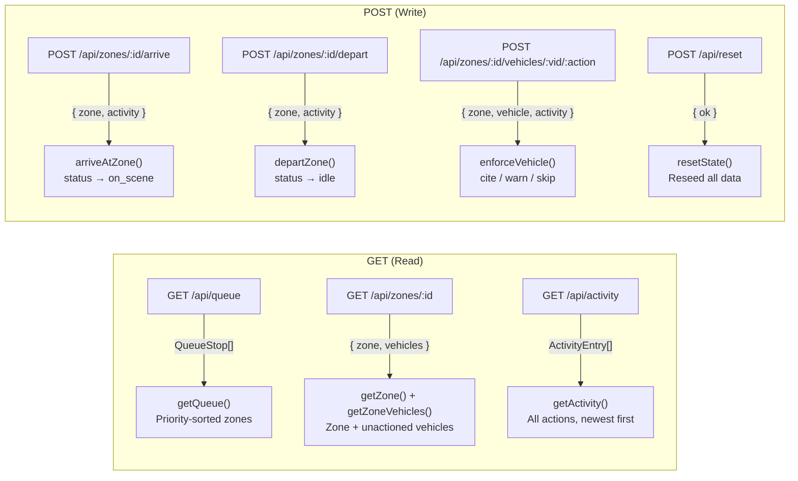
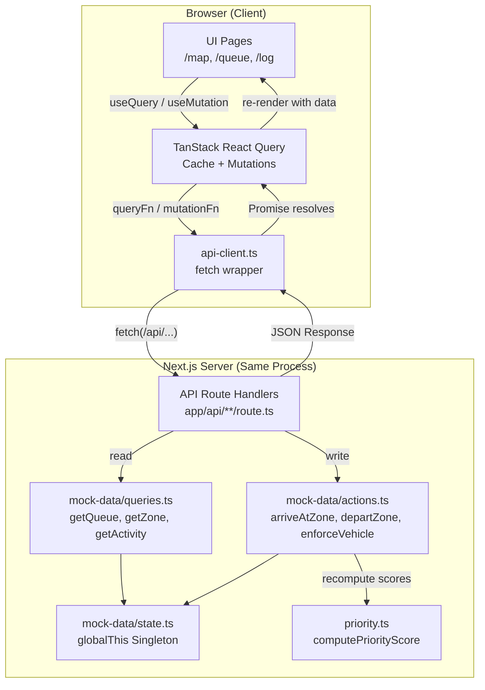
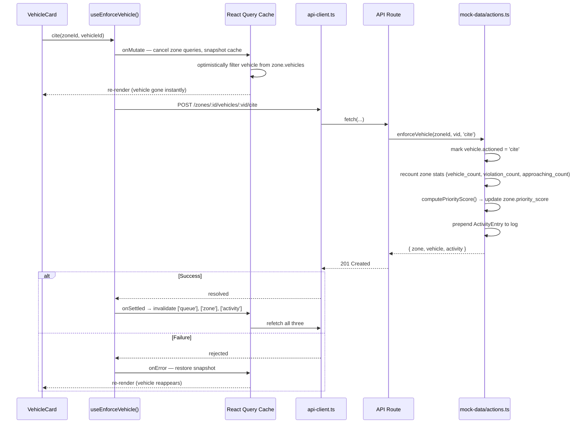
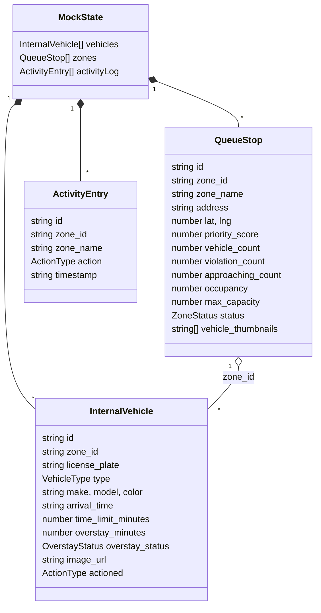
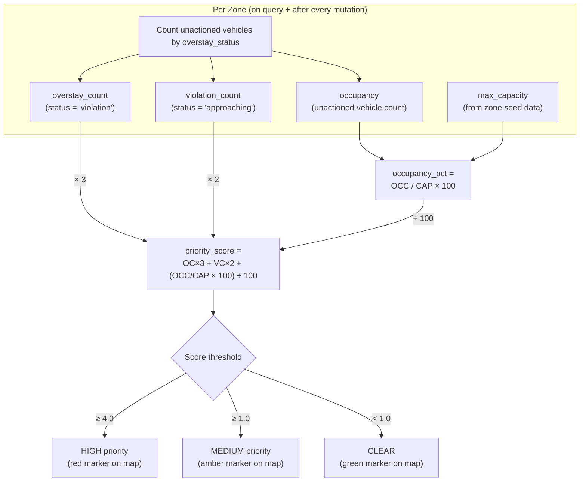
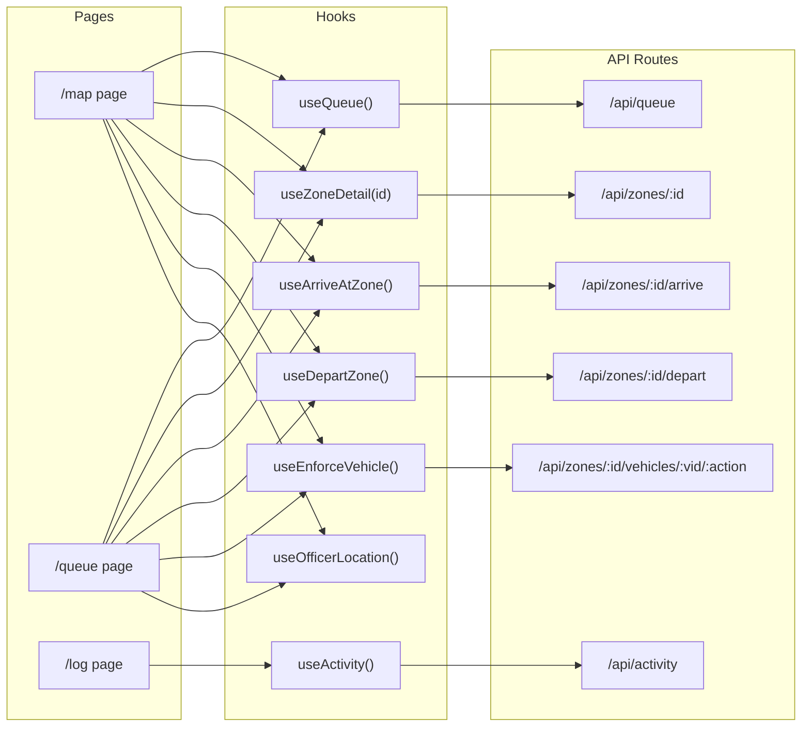
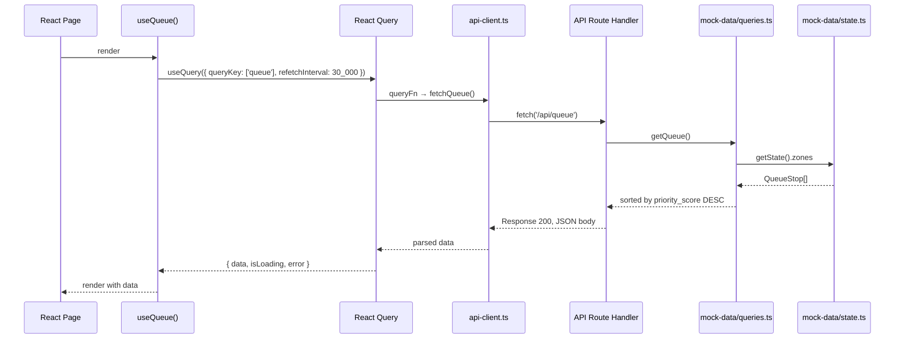
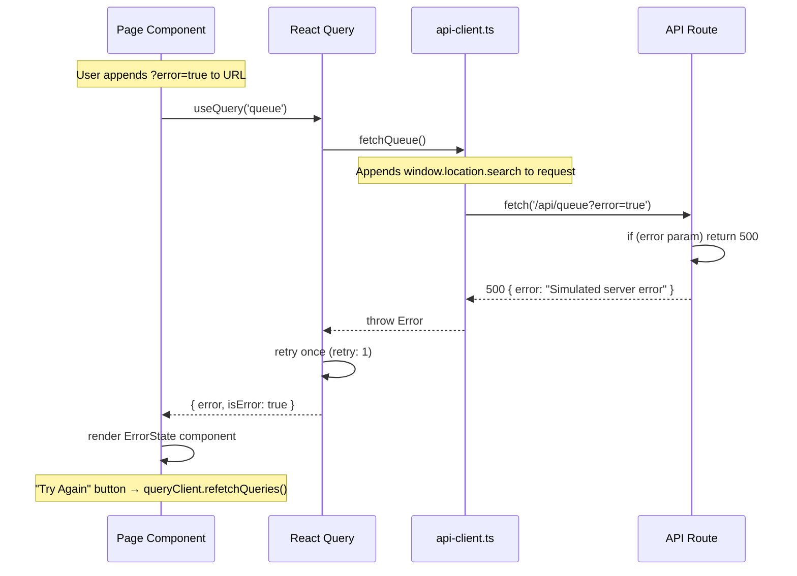
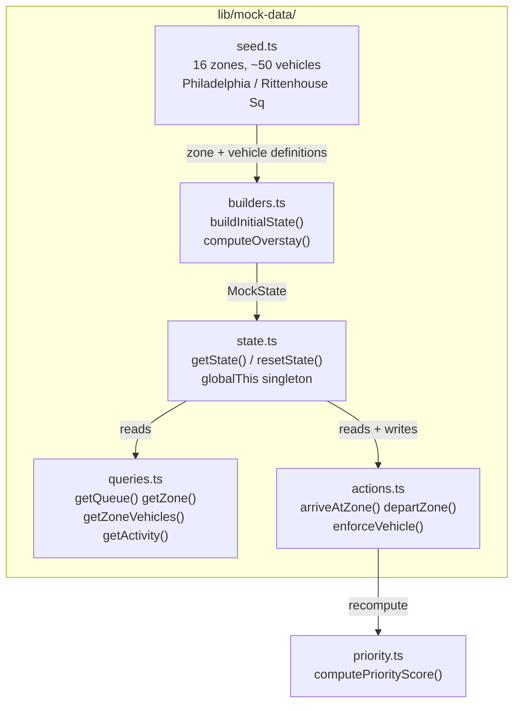

# Automotus Go: End-to-End Architecture & Communication Flow

## API Endpoints

Every write endpoint is **atomic**: it mutates state + prepends an `ActivityEntry` to the log in a single call. The client never coordinates multiple requests per action.

All routes simulate 200–800ms network latency. Appending `?error=true` to any route returns a 500.

---

## High-Level System Overview

---

## Mutation Flow (Optimistic Updates)

---

## Data Layer: In-Memory Mock Store

The entire store lives on `globalThis.__automotus_go_mock_state__` so it survives HMR in dev. `resetState()` replaces it with fresh seed data from `mock-data/seed.ts`.

### Type Enums

| Type | Values |
|------|--------|
| `ZoneStatus` | `idle`, `on_scene` |
| `VehicleType` | `personal`, `rideshare`, `delivery`, `commercial` |
| `OverstayStatus` | `ok`, `approaching`, `violation` |
| `EnforcementAction` | `cite`, `warn`, `skip` |
| `ZoneAction` | `arrive`, `depart` |
| `ActionType` | `EnforcementAction \| ZoneAction \| 'clear'` |

---

## Priority Scoring Pipeline

The score is recomputed in `enforceVehicle()` after every cite/warn/skip — removing a violation vehicle drops the zone's score and re-sorts the queue.

---

## Component → Hook → API Mapping

---

## Request/Response Lifecycle

---

## Error Simulation Flow

---

## Mock Data Architecture

- **seed.ts**: Raw zone/vehicle definitions for 16 Philadelphia intersections around Rittenhouse Square
- **builders.ts**: Constructs initial `MockState`, computes overstay status from arrival times
- **state.ts**: Singleton on `globalThis.__automotus_go_mock_state__` — survives HMR
- **queries.ts**: Pure reads — `getZoneVehicles()` filters out actioned vehicles before returning
- **actions.ts**: Mutations — each action marks vehicles, recounts zone stats, recomputes priority, logs activity
